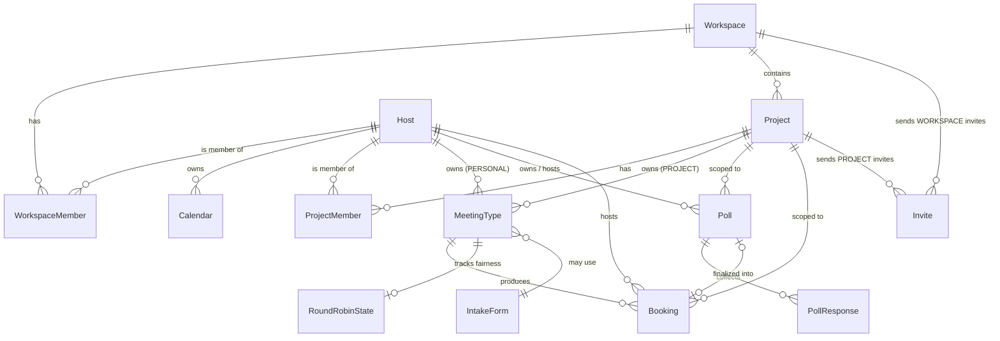
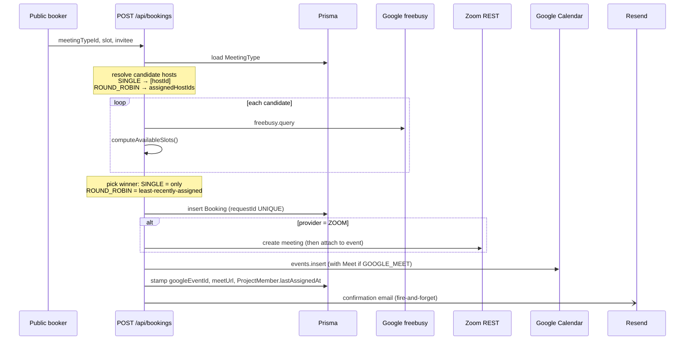

# Soul Suite — architecture

You've just inherited this codebase. This is the map. For product spec read `~/Downloads/soul-scheduler-brief.md`; for engineering conventions read `CLAUDE.md`. This file documents what's actually been built and how the pieces fit together.

## What this is

Soul Suite is a self-hosted scheduling layer on top of Google Calendar for the Soul collective at soul.com. Think "Calendly we own." It models three layers — **Workspace → Project → Personal** — so a single workspace (Soul) can run shared projects with internal hosts and external collaborators, while every host also has their own personal booking page. v1 is single-workspace and Soul-internal, but the schema is multi-tenant so we don't have to rewrite when that changes.

## Stack

- **Runtime** — Node.js 20+, TypeScript strict
- **Web** — Next.js 15 App Router, React 19. Server Components by default; `"use client"` only for interactive UI
- **DB** — Postgres (Supabase). Prisma owns the schema. Never edit tables in the Supabase dashboard
- **Auth** — Supabase Auth + Google OAuth (offline access). Refresh tokens captured at `exchangeCodeForSession` time and stored on `Host.googleRefreshToken`
- **Calendar API** — `googleapis`, server-side only. Per-host OAuth2 client built from the stored refresh token
- **Conferencing** — Google Meet (default, attached to Google events) or Zoom (per-host User-managed OAuth, REST API)
- **Email** — Resend (graceful no-op when unconfigured — see `src/lib/email.ts:9`)
- **UI** — Tailwind v4 + CSS-variable tokens, shadcn-style primitives we own at `src/components/ui/`
- **Hosting** — Vercel
- **Tests** — Vitest. Pure-function focus on the availability engine (`src/lib/availability/engine.test.ts`)

## Domain model

The full schema lives at `prisma/schema.prisma`. The relationships (only the load-bearing ones — enums and bookkeeping fields omitted):



Read alongside the schema:

- **Workspace** (`schema.prisma:24`) — top-level tenant. v1 has exactly one ("Soul"). Owns branding (`logoUrl`, `brandColor`) that overrides the `--primary` token in the AppShell.
- **Host** (`schema.prisma:63`) — one per Google identity. Mirrors `auth.users.id`. Carries `googleRefreshToken` (cached from Supabase Auth) and optionally `zoomRefreshToken` for the Zoom integration. `slug` shares URL space with `Project.slug`.
- **WorkspaceMember** — joins Host to Workspace with a role (`OWNER` | `ADMIN` | `MEMBER`). The first @soul.com sign-in becomes OWNER (`src/lib/workspace.ts:20`).
- **Project** + **ProjectMember** — a project groups internal Soul hosts and (optionally) external collaborators. `ProjectMember.lastAssignedAt` powers round-robin fairness.
- **Calendar** — pointer to a Google calendar with a role (`PRIMARY`, `CONFLICT_CHECK`, `WRITE_TARGET`). `WRITE_TARGET` is where new events land. By default the host's `CONFLICT_CHECK ∪ WRITE_TARGET` set is used for freebusy; per-meeting-type overrides via `MeetingType.conflictCalendarIds`.
- **MeetingType** (`schema.prisma:181`) — the bookable thing. Polymorphic: `scope = PERSONAL` (lives under a `Host`) or `PROJECT` (lives under a `Project`). `routingMode` is `SINGLE` or `ROUND_ROBIN`. `assignedHostIds` is the list of hosts who can take it. Slug uniqueness is per-scope (`@@unique([hostId, slug])` and `@@unique([projectId, slug])`).
- **IntakeForm** — JSON-driven form definition. 1:N to MeetingType (multiple MTs can share a form, even though the UI currently inlines one per MT — see Backlog).
- **Booking** — confirmed time. Carries `requestId` (idempotency key, `schema.prisma:272`), `googleEventId`, conferencing fields (`conferencingProvider`, `meetUrl`, `providerMeetingId`), and a status enum (`CONFIRMED` | `CANCELLED` | `RESCHEDULED`).
- **Poll** + **PollResponse** — group scheduling: owner proposes N slots, invitees vote YES/MAYBE/NO via a tokenised public link. Finalization creates a `Booking` and links it via `Poll.finalizedBookingId`.
- **Invite** — single table for both `WORKSPACE` and `PROJECT` invites with a tokenised acceptance flow. The role column is a string holding either a `WorkspaceRole` or a `ProjectRole`.
- **ReservedSlug** — DB-backed reserved-word list, checked alongside `Host.slug` and `Project.slug` in `assertSlugAvailable` (`src/lib/slugs.ts:18`).

### Cross-cutting invariants

- **Slug uniqueness is cross-table** — `Host.slug` and `Project.slug` share `/{slug}/...` URL space. Enforcement is application-layer today (`src/lib/slugs.ts`), with a future SQL trigger as backup (brief §Slug collisions).
- **All times stored UTC.** Render in the invitee's detected timezone with manual override. The availability engine is timezone-aware and DST-tested.
- **Booking idempotency.** `requestId` derives from `(meetingTypeId, hostId, startsAt, inviteeEmail)`. Retries collide on the unique index instead of double-booking.

## Key flows

### Booking creation

`POST /api/bookings` (`src/app/api/bookings/route.ts`). The hot path:



Host resolution lives at `src/app/api/bookings/route.ts:67`. Round-robin fairness (least-recently-assigned, tie-broken by `addedAt`) is in `src/lib/round-robin.ts:58`. The booking row is inserted before the Google event so a Google failure can roll the row back via `requestId` cleanup (`src/app/api/bookings/route.ts:267`). Zoom meetings are created **before** the Google event so a Zoom failure doesn't leave a dangling calendar entry (`src/app/api/bookings/route.ts:189`).

### Reschedule

`POST /api/bookings/[id]/reschedule` (`src/app/api/bookings/[id]/reschedule/route.ts`). Re-validates availability with a fresh freebusy query, **filtering out the booking's own busy block** so it doesn't conflict with itself (line 69). Patches the Google event in place, updates the Zoom meeting if applicable, sets `status = RESCHEDULED`, sends an email.

### Cancel

`POST /api/bookings/[id]/cancel` (`src/app/api/bookings/[id]/cancel/route.ts`). Best-effort tear-down: deletes the Google event, deletes the Zoom meeting if any, then marks the booking `CANCELLED`. Failures on either external service are swallowed — the row is still marked cancelled so the invitee never sees a "ghost" booking.

### Auth + workspace bootstrap

1. Supabase OAuth round-trip lands at `src/app/auth/callback/route.ts`. The refresh token is captured **here** (the only point where Supabase surfaces it) and stored on `Host.googleRefreshToken`.
2. `ensureHostFromAuthUser` (`src/lib/auth.ts:44`) creates/claims the Host. Seeded placeholder rows (e.g. `sjoerd@soul.com`) get claimed on first real sign-in by matching email.
3. `resolvePostSignIn` (`src/lib/workspace.ts:40`) walks the decision tree:
   - First @soul.com user ever → bootstraps the workspace, makes them OWNER
   - Existing @soul.com member → straight in
   - @soul.com with pending workspace invite → accept it, in
   - @soul.com without invite → `needs-access-request`
   - Non-@soul.com with pending project invite → accept, becomes external collaborator
   - Otherwise → rejected
4. New users land on onboarding (calendar picker → working hours).

### Zoom OAuth

User-managed OAuth, scopes `meeting:write:meeting + user:read:user`. Start at `/api/oauth/zoom/start`, callback at `src/app/api/oauth/zoom/callback/route.ts`. State is verified via cookie. Tokens stored on `Host.zoomRefreshToken`. Refresh tokens **rotate on each use** so `getZoomAccessTokenForHost` (`src/lib/zoom/host.ts:9`) always persists the new refresh token alongside the access token.

### Invite acceptance

Workspace and project invites share one `Invite` table. The acceptance flow happens transparently inside `resolvePostSignIn` when an invited user signs in for the first time: matching invite found → `WorkspaceMember` or `ProjectMember` row created → invite marked `acceptedAt`.

### Polls

- **Create** (`POST /api/polls`) — owner picks 2–20 proposed slots, invitee emails (1–50), duration. Each invitee gets a `PollResponse` row with an unguessable `token`.
- **Vote** (`POST /api/polls/respond/[token]`) — public, idempotent: replaces the votes map. Validates that voted slot ids belong to this poll (`src/app/api/polls/respond/[token]/route.ts:24`).
- **Finalize** (`PATCH /api/polls/[id]` with `action: "finalize"`) — owner-only. Creates a Google event, then in one transaction creates an **ephemeral inactive `MeetingType`** (poll-as-meeting-type anchor), a `Booking`, and stamps `Poll.status = FINALIZED + finalizedBookingId`. The ephemeral MT is the workaround for `Booking.meetingTypeId` being NOT NULL.

## Conventions (the short version)

- **Design system is the only source of styles.** Every UI primitive lives at `src/components/ui/`. Never re-style raw `<button>` / `<input>` inline. Add a variant if you need a new look. Tokens are CSS variables in `globals.css`, exposed to Tailwind via `@theme`.
- **Server Components by default.** Forms typically split: server `page.tsx` loads data + renders shell, sibling `form.tsx` is `"use client"` and POSTs to a route handler.
- **Page boilerplate.** Every authenticated page starts:
  ```ts
  const ctx = await getPageContextOrRedirect();
  return <AppShell {...shellProps(ctx)}>...</AppShell>;
  ```
  See `src/lib/page-context.ts:19`. Workspace `brandColor` overrides `--primary` at the shell level.
- **Permissions checked at the route handler.** `canManageWorkspace` and `canManageProject` in `src/lib/permissions.ts`. Workspace settings → owner/admin. Project settings → lead.
- **API route shape.** Load host (401 if missing) → check role (403) → zod-validate body (400) → write inside a transaction when multiple rows must be consistent.
- **Slugs.** Cross-table unique via `assertSlugAvailable` (`src/lib/slugs.ts:18`); always called inside the create transaction. Reserved-word list lives in `src/lib/slugs.constants.ts` + the `ReservedSlug` table.
- **Timezones.** All UTC at rest. Engine takes `now` as a parameter for testability — the test file (`src/lib/availability/engine.test.ts`) covers DST transitions explicitly.
- **Edit / Save / Cancel.** Settings forms render read-only by default; Edit unlocks; Save persists; Cancel reverts. (Established pattern across `/settings/*`.)

## External integrations

### Google

- **Auth** — Supabase Auth surfaces a `provider_refresh_token`; we cache it on `Host.googleRefreshToken`. `makeOAuth2ClientForHost` (`src/lib/google/client.ts:7`) builds a per-host OAuth2 client from it; googleapis auto-refreshes the access token.
- **Calendar** endpoints used:
  - `freebusy.query` — batched conflict check across the host's chosen calendars (`src/lib/availability/freebusy.ts:49`)
  - `events.insert` — booking creation (`conferenceDataVersion=1` to provision Meet)
  - `events.patch` — reschedule
  - `events.delete` — cancel
  - `calendars.list` — onboarding calendar picker
- **Auth-failure handling** — `isGoogleAuthError` (`src/lib/google/client.ts:41`) detects 401/403; on hit we null out the host's `googleRefreshToken` so the UI can prompt re-connect.
- **Calendar filtering** — `isHostOwnedCalendar` excludes other people's Workspace calendars that the host happens to have access to (`src/lib/google/client.ts:27`).

### Zoom

REST against `api.zoom.us/v2`. `src/lib/zoom/client.ts` wraps:

- `POST /oauth/token` (authorization_code + refresh_token grants)
- `GET /users/me`
- `POST /users/me/meetings` — scheduled (type=2) meeting at booking time
- `PATCH /meetings/{id}` — reschedule
- `DELETE /meetings/{id}` — cancel

Zoom rotates refresh tokens on every refresh; `getZoomAccessTokenForHost` (`src/lib/zoom/host.ts:9`) always persists the new one or the next call 401s.

### Resend (email)

`src/lib/email.ts`. Side-effect, never blocks the API call (`void sendEmail(...)` in route handlers). Templates:

- `bookingConfirmationTemplate` — sent on booking creation, includes Reschedule + Cancel buttons
- `bookingCancellationTemplate`
- `bookingRescheduleTemplate`
- `pollInviteTemplate` — one per invitee, with a tokenised vote URL

`From` header reads `${hostName} via Soul Suite <verified@domain>` so recipients see the host's name; `Reply-To` routes to the host's actual email. The workspace logo renders on a forced-white background to survive dark-mode email clients (`src/lib/email.ts:87`).

### Supabase

- `src/lib/supabase/client.ts` — browser
- `src/lib/supabase/server.ts` — cookie-bound server
- `src/lib/supabase/service.ts` — service role, server-only. Never reach for it from a client component or expose via `NEXT_PUBLIC_`.

## What's NOT built yet

Pulled from the backlog. Steps 1–12 (auth, meeting types, availability engine, public booking, reschedule, cancel, projects, project meeting types, invites, polls, inbox, email confirmations) shipped. Plus Zoom conferencing.

In rough priority order:

1. **Project-scoped polls** — schema already supports `Poll.scope = PROJECT`; just needs a Project picker on the create form, a project-lead permission check on finalize, and `projectId` propagation onto the produced booking.
2. **Meeting type templates** — workspace-level `MeetingTypeTemplate` table + "Start from template" picker on the project MT create form. Templates as blueprints; instances are independent post-create.
3. **`COLLECTIVE` routing mode** — third value on `RoutingMode` enum. All assigned hosts must be free; only the intersection of availabilities is offered.
4. **Reusable intake forms across MTs** — schema already supports it (1 IntakeForm → N MeetingTypes); UI currently inlines a 1:1 editor. Need `/settings/intake-forms` and a "Use existing form" picker.
5. **Project-level working hours override** — `ProjectMember.workingHoursOverride: Json?`. Overrides personal working hours when computing project-bookable slots.
6. **Microsoft Teams conferencing** — analogous to Zoom (OAuth + per-host refresh token + REST calls). The `ConferencingProvider` enum already lists `TEAMS`.
7. **Contact list (deferred until last)** — auto-built directory keyed on email per-workspace, populated/updated from `Booking` rows. Manual fields (Phone, Company, Job title, LinkedIn, Location). Sidebar nav under Workspace; routes `/dashboard/contacts` + `/dashboard/contacts/[id]`.

DB-level slug-uniqueness trigger is also still pending — application-layer enforcement only today.

## Open product questions

Defaults are coded but should be confirmed before shipping to users (brief §Open questions). Do not silently surface UI for switching between options unless asked — pick one, ship.

1. **Shared dashboard vs per-host?** Currently per-host (signed-in host's data only).
2. **Round-robin fairness rule.** Default: least-recently-assigned (uses `ProjectMember.lastAssignedAt`). Alternative: fewest total bookings this month.
3. **Poll vote visibility.** Default: visible to other invitees as votes come in (not anonymous-until-finalized).
4. **Email sender domain + From-address.** Needs DNS setup before Resend can send from a verified domain. The code already handles the unconfigured case gracefully (logs instead of sending).
